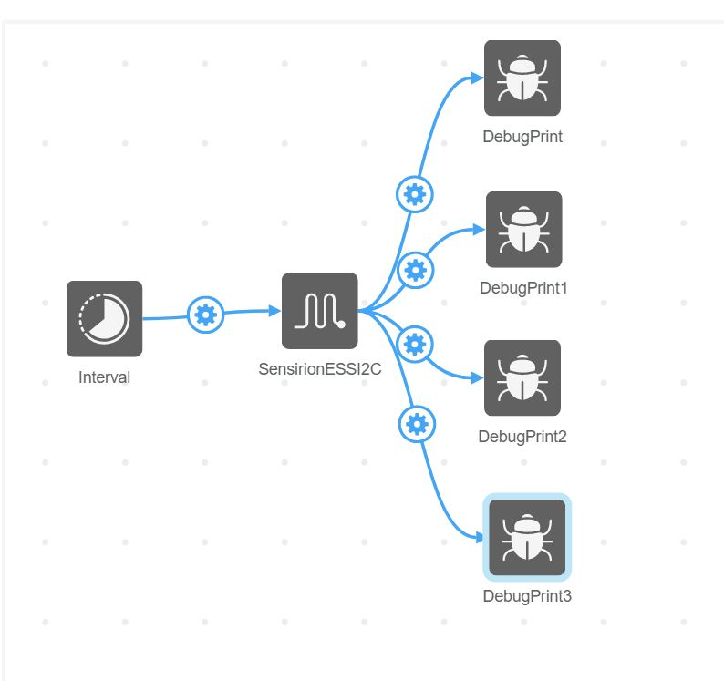
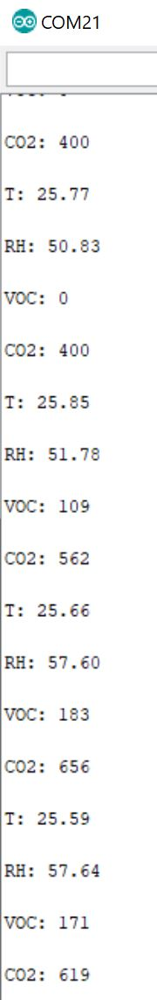

# Sensirion ESS EEL

This is library to add support for the Sensirion ESS to Atmosphere IoT

## Features

This implementation features:
- Support for SHTC1 humidity & temperature sensor
- Support for SGP30 Total VOC & CO2 equivalent sensor
- CRC checksums to detect I2C bus errors
- cache readouts

## Usage:

1. Use the [EEL builder](https://github.com/atmosphereiot/eel-builder) to create an EEL from the code
1. Open Atmosphere IoT
1. create a new project
1. Select "Add element", then "Import" and select the EEL built in step 1
1. Place an interval element (leave it at 1000 ms)
1. Place an ESS element
1. Place four DebugPrint elements
1. On the interval element, create four events triggering the sensor read events on the ESS for temperature, humidity, tvoc and CO2eq
1. Create events to connect the sensor data read triggers with the print ability; map each sensor trigger to a different print out
1. export the code, compile, enjoy

Your design should look like this:

The output in the Arduino serial monitor should look like this:

## Notes

This has only been tested on the Arduino Mega platform
